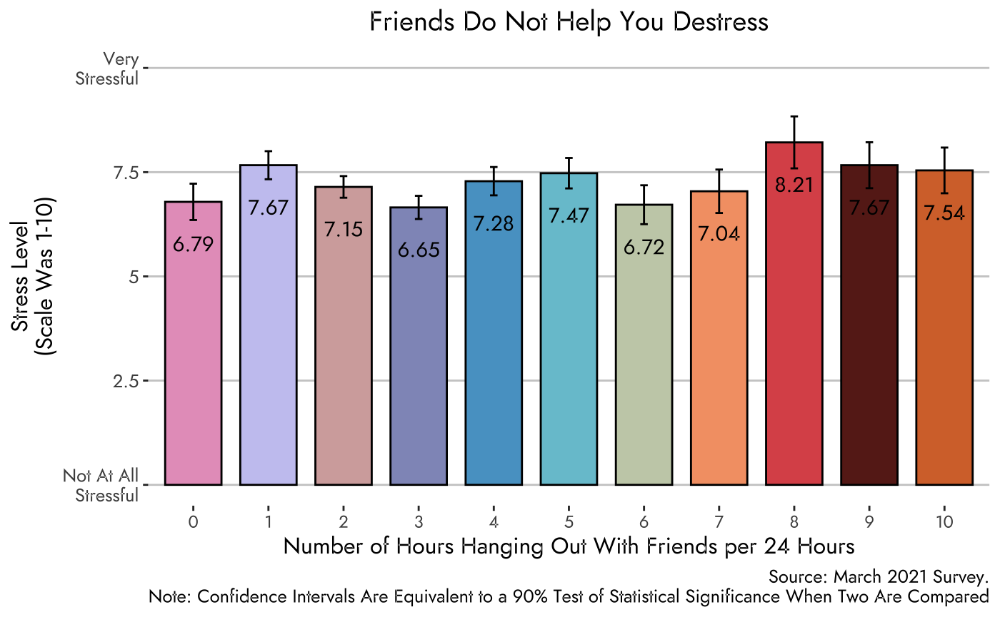
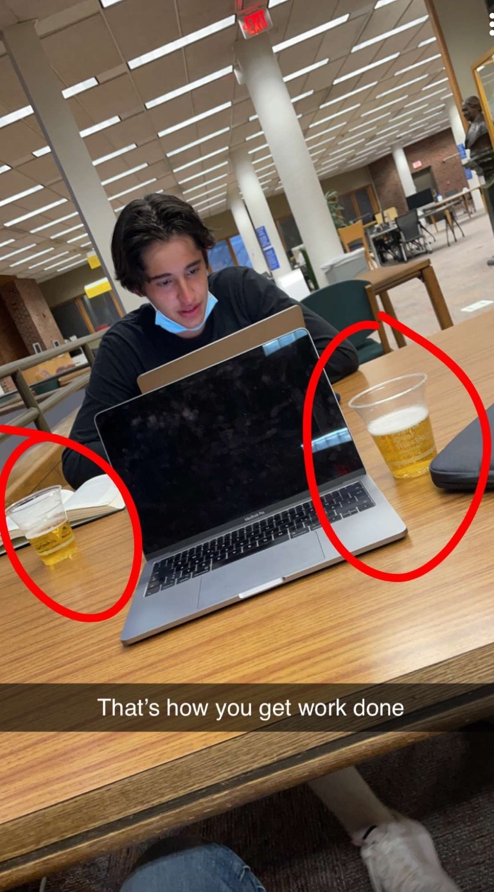
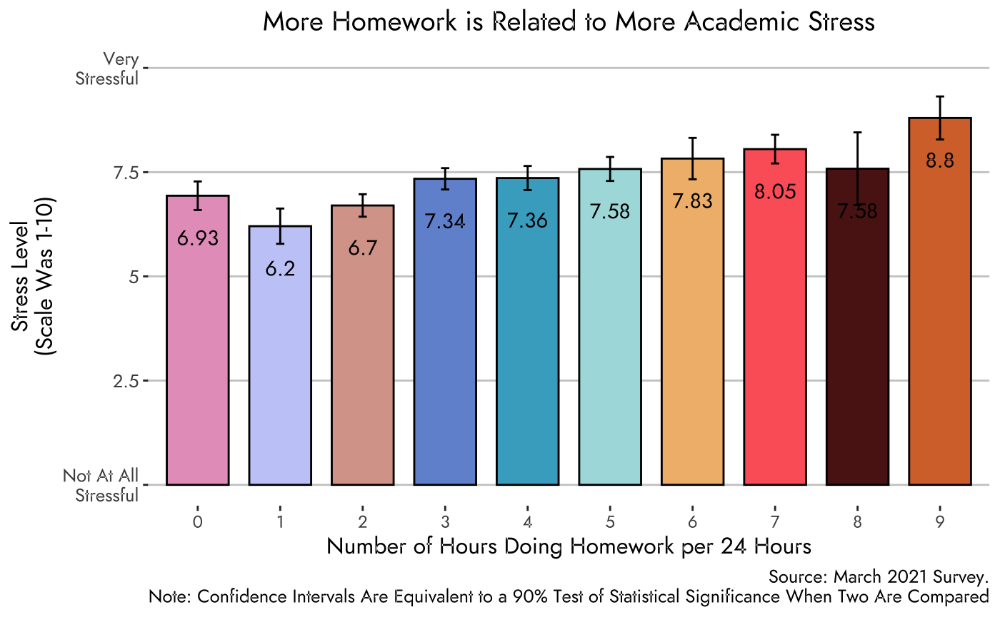
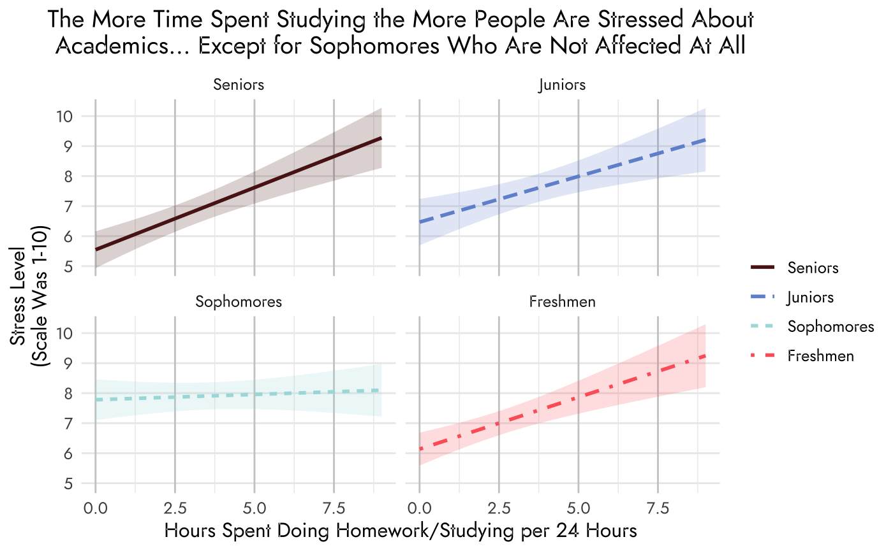

class: split-60  hide-slide-number

.column.bg-main4[.content.vmiddle[
##From pulling an all nighter my freshman year (DO NOT RECOMMEND), to turning papers in with less than a minute left to spare (something I am quite proud of actually), to writing a 51 page Senior Thesis, I have had my fair share of academic stress.

]
]

.column.bg-main4[.content.vmiddle[
.center[
.img-fill[]
]
]]

---

class: split-40 hide-slide-number bg-main4

.row.bg-main4[.content.vmiddle[
##With finals coming up soon, many of my friends have talked about how they are just swamped with homework and studying and how they are really stressed. This got me wondering: 
]]

.row.bg-main4[.sliderbox.vmiddle[

]]

---

class: split-40 hide-slide-number bg-main4

.row.bg-main4[.content.vmiddle[
##With finals coming up soon, many of my friends have talked about how they are just swamped with homework and studying and how they are really stressed. This got me wondering: 
]]

.row.slide-in-bottom[.sliderbox.bg-main5.vmiddle[
#How stressed are students about academics and how does that compare 
#to other things?
]]

---

class: split-30 with-thick-border hide-slide-number

.column.bg-main1[.content.vmiddle[
.center[
###What Causes Students the Most Stress
To answer this question we asked students:
>How stressful are the following aspects of campus life? Use the scale where 0 means not at all stressful and 10 means very stressful.
]
]]

.column.bg-main5[.split-10.border-white[
.row[.content.center[

]]
.row[.content.nopadding[
.fig90[]
]]
]]

---

class: shuriken-200 hide-slide-number with-thick-border border-white

.blade1.bg-main5[.sliderbox.center.vmiddle[

]]
.blade2.bg-main5[.sliderbox.vertical-rl.center.vmiddle[

]]
.blade3.bg-main5[.sliderbox.center.vmiddle[

]]
.blade4.bg-main5[.sliderbox.sideways-lr.center.vmiddle[

]]
.hole.bg-main4[.content.center.vmiddle[
#Some factors I will investigate
]]

---

class: shuriken-200 hide-slide-number with-thick-border border-white

.blade1.bg-main8.slide-in-left[.sliderbox.center.vmiddle[
#Time with friends
]]
.blade2.bg-main5[.content.vertical-rl.center.vmiddle[

]]
.blade3.bg-main5[.sliderbox.center.vmiddle[

]]
.blade4.bg-main5[.sliderbox.sideways-lr.center.vmiddle[

]]
.hole.bg-main4[.content.center.vmiddle[
#Some factors I will investigate
]]

---

class: shuriken-200 hide-slide-number with-thick-border border-white

.blade1.bg-main8[.sliderbox.center.vmiddle[
#Time with friends
]]
.blade2.bg-main9.slide-in-top[.content.vertical-rl.center.vmiddle[
#Time sleeping
]]
.blade3.bg-main5[.sliderbox.center.vmiddle[

]]
.blade4.bg-main5[.sliderbox.sideways-lr.center.vmiddle[

]]
.hole.bg-main4[.content.center.vmiddle[
#Some factors I will investigate
]]

---
class: shuriken-200 hide-slide-number with-thick-border border-white

.blade1.bg-main8[.sliderbox.center.vmiddle[
#Time with friends
]]
.blade2.bg-main9[.content.vertical-rl.center.vmiddle[
#Time sleeping
]]
.blade3.bg-main7.slide-in-right[.sliderbox.center.vmiddle[
#Time exercising
]]
.blade4.bg-main5[.sliderbox.sideways-lr.center.vmiddle[

]]
.hole.bg-main4[.content.center.vmiddle[
#Some factors I will investigate
]]

---

class: shuriken-200 hide-slide-number with-thick-border border-white

.blade1.bg-main8[.sliderbox.center.vmiddle[
#Time with friends
]]
.blade2.bg-main9[.content.vertical-rl.center.vmiddle[
#Time sleeping
]]
.blade3.bg-main7[.sliderbox.center.vmiddle[
#Time exercising
]]
.blade4.bg-main6.slide-in-bottom[.sliderbox.sideways-lr.center.vmiddle[
#Time studying
]]
.hole.bg-main4[.content.center.vmiddle[
#Some factors I will investigate
]]

---

class: split-30 hide-slide-number with-thick-border

.row.bg-main8[.content.center[
##Hanging out with friends could result in three 
##very different experiences for students:
 
]]

.row.bg-main8[.content.center[
.split-three[
.column[.content.center[
]]
.column[.content.center[
]]
.column[.content.center[
]]
]]]

---

class: split-30 hide-slide-number with-thick-border
.row.bg-main8[.content.center[
##Hanging out with friends could result in three 
##very different experiences for students:
]]
.row.bg-main8[.content.center[
.split-three[
.column[.content.center.vmiddle[
###1. Students who hangout with friends more, have less time to do homework and study. This ultimately leads to more stress.
]]

.column[.content.center.vmiddle[
]]

.column[.content.center.vmiddle[
]]
]]]

---

class: split-30 hide-slide-number with-thick-border

.row.bg-main8[.content.center[
##Hanging out with friends could result in three 
##very different experiences for students:
]]

.row.bg-main8[.content.center[
.split-three[
.column[.content.center.vmiddle[
###1. Students who hangout with friends more, have less time to do homework and study. This ultimately leads to more stress.
]]

.column[.content.center.vmiddle[
###2. Students may spend time with friends to destress from academics 
###and everything else going on. This would lead to less stress
]]

.column[.content.center.vmiddle[
]]
]]]

---

class: split-30 hide-slide-number with-thick-border
.row.bg-main8[.content.center[
##Hanging out with friends could result in three 
##very different experiences for students:
]]

.row.bg-main8[.content.center[
.split-three[
.column[.content.center.vmiddle[
###1. Students who hangout with friends more, have less time to do homework and study. This ultimately leads to more stress.
]]

.column[.content.center.vmiddle[
###2. Students may spend time with friends to destress from academics 
###and everything else going on. This would lead to less stress
]]

.column[.content.center.vmiddle[
###3. Students may hangout with friends while studying, eating, or doing something else. This would lead to time spent with friends having no effect on academic stress
]]
]]]

---

class: split-70 with-thick-border hide-slide-number

.column.bg-main5[.split-10.border-white[
.row[.content.center[

]]
.row[.content.nopadding[
.fig90[]
]]
]]

.column.bg-main8[.content.vmiddle[
.center[
###As we can see in the graph to the right, hanging out with friends does not have a relationship with academic stress. I believe that this is caused by a combination of all three factors mentioned in the previous slide.
]
]]

---

class: split-40 middle center bg-main9 hide-slide-number

.column[.content[
.figb90[]
]
]

.column[.content[
#How about sleep?
 
##Based on the [interconnected relationship](https://www.sleep.org/sleep-and-stress/) between sleep and stress, I would expect students who get appropriate levels of sleep would have the least amount of stress.

]
]

---

class: split-30 with-thick-border hide-slide-number

.column.bg-main9[.content.vmiddle[
.center[
###Long story short, if you want less stress, get seven hours of sleep.
 
I believe that part of this is because it finds the perfect balance of enough sleep and time to do stuff. Part of the reason students who get 5-6 hours of sleep are more stressed is because they are getting so little sleep but also because they probably have a lot of homework that is taking away from sleep. As for students who get 8-10 hours it is possible that this is too much sleep and they do not have enough time to get their work done along with everything else they want to do. 
]
]]

.column.bg-main5[.split-10.border-white[
.row[.content.center[

]]
.row[.content.nopadding[
.fig90[]
]]
]]

---

class: split-40 middle center bg-main7 hide-slide-number

.column[.content[
.img-fill[]
]
]

.column[.content[
#What about exercise? 
 
##Well, given the fact that it has been proven that exercising helps alleviate [mental stress](https://www.health.harvard.edu/staying-healthy/exercising-to-relax), I would expect students who report getting some exercise in would have the lowest levels of academic stress.

]
]

---

class: split-30 with-thick-border hide-slide-number

.column.bg-main7[.content.vmiddle[
.center[
###Looking at the graph to the right, 
###we can see that exercising does in fact decrease stress. 
 
####Students who report 
####getting 1-2 hours of exercise  every day report the least amount of stress. However, once students start getting 3+ hours, stress spikes. This 
####is likely driven by having too little time to finish assignments on time
]
]]

.column.bg-main5[.split-10.border-white[
.row[.content.center[

]]
.row[.content.nopadding[
.fig90[]
]]
]]

---

class: split-70 middle center bg-main6 hide-slide-number

.column[.content[
.split-90[
.row[.content[
#Lastly, how does studying affect stress? 
 
###I would expect that students who have more homework or studying are likely overwhelmed and thus have more stress. Moreover, students who spend more time studying likely put more importance on their academics and thus are more stressed about them.
]]

.row[.content[
(Despite the image, drinking while studying is not recommended and I do not encourage the behavior.)
]]
]
]]

.column[.content[
.img-fill[]
]
]

---

class: split-70 with-thick-border hide-slide-number

.column.bg-main5[.split-10.border-white[
.row[.content.center[

]]
.row[.content.nopadding[
.fig90[]
]]
]]

.column.bg-main6[.content.vmiddle[
.center[
###Turns out that more studying does lead to more stress. This probably the least surprising result of this entire slide show. More studying likely leads to the feeling of being overwhelmed and in turn more stress.
]
]]

---

class: hide-slide-number middle center bg-main4 

##Unfortunately other things that people do throughout the day (like sleeping, exercising, and hanging out with friends) might affect the results. Nevertheless, using an interaction plot we can take these factors into account. Moreover, we can see how other factors, like class year are affected differently.

---

class: split-60 with-thick-border hide-slide-number

.column.bg-main5[.split-10.border-white[
.row[.content.center[

]]
.row[.content.nopadding[
.fig90[]
]]
]]

.column.bg-main6[.content.vmiddle[
.center[
####The graph to the left is an interaction plot that looks at how studying affects stress level for each class year. We can see that for freshmen, juniors, and seniors more studying leads to more stress which suggests that studying does affect and is not the result of covariation. For sophomores, there is no relationship whatsoever. It is unclear why this is the case but it is something that should be investigated more.
]
]]

---

class: hide-slide-number middle center bg-main4 

###Throughout this presentation I sought to demonstrate some factors that contribute to academic stress. It turns out that the amount of time spent studying/doing homework, sleeping, and exercising all impact stress. Getting seven hours of sleep and exercising for one to two hours every day are two things that are easy to accomplish and will reduce  stress.  
 
###Moreover, less time spent studying decreases stress. So when you're stressed about an upcoming exam or a paper or project, remember you don't need to get 100% and it does not have to be perfect. Your mental health is more important than that extra little percentage you would get from all that extra time spent studying.

