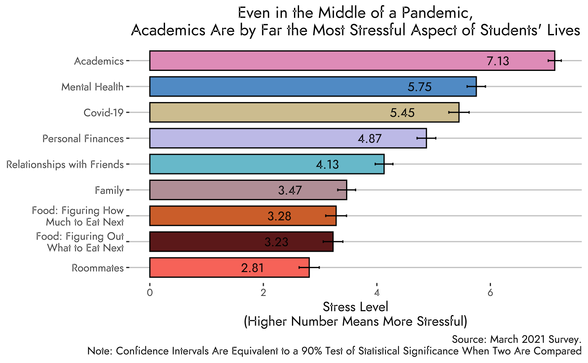

class: split-60  hide-slide-number

.column.bg-main4[.content.vmiddle[
##From pulling an all nighter my freshman year (DO NOT RECOMMEND), to turning papers in with less than a minute left to spare (something I am quite proud of actually), to writing a 51 page Senior Thesis, I have had my fair share of academic stress.

]
]

.column.bg-main4[.content.vmiddle[
.center[
.img-fill[]
]
]]

---

class: split-40 hide-slide-number bg-main4

.row.bg-main4[.content.vmiddle[
##With finals coming up soon, many of my friends have talked about how they are just swamped with homework and studying and how they are really stressed. This got me wondering: 
]]

.row.bg-main4[.sliderbox.vmiddle[

]]

---

class: split-40 hide-slide-number bg-main4

.row.bg-main4[.content.vmiddle[
##With finals coming up soon, many of my friends have talked about how they are just swamped with homework and studying and how they are really stressed. This got me wondering: 
]]

.row.slide-in-bottom[.sliderbox.bg-main5.vmiddle[
#How stressed are students about academics and how does that compare 
#to other things?
]]

---

class: split-30 with-thick-border

.column.bg-main1[.content.vmiddle[
.center[
###What Causes Students the Most Stress
To answer this question we asked students:
>How stressful are the following aspects of campus life? Use the scale where 0 means not at all stressful and 10 means very stressful.
]
]]

.column.bg-main5[.split-10.border-white[
.row[.content.center[

]]
.row[.content.nopadding[
.fig90[]
]]
]]

---

class: shuriken-200 hide-slide-number with-thick-border border-white

.blade1.bg-main5[.sliderbox.center.vmiddle[

]]
.blade2.bg-main5[.sliderbox.vertical-rl.center.vmiddle[

]]
.blade3.bg-main5[.sliderbox.center.vmiddle[

]]
.blade4.bg-main5[.sliderbox.sideways-lr.center.vmiddle[

]]
.hole.bg-main4[.content.center.vmiddle[
#Some factors I will investigate
]]

---

class: shuriken-200 hide-slide-number with-thick-border border-white

.blade1.bg-main8.slide-in-left[.sliderbox.center.vmiddle[
#Time with friends
]]
.blade2.bg-main5[.content.vertical-rl.center.vmiddle[

]]
.blade3.bg-main5[.sliderbox.center.vmiddle[

]]
.blade4.bg-main5[.sliderbox.sideways-lr.center.vmiddle[

]]
.hole.bg-main4[.content.center.vmiddle[
#Some factors I will investigate
]]

---

class: shuriken-200 hide-slide-number with-thick-border border-white

.blade1.bg-main8[.sliderbox.center.vmiddle[
#Time with friends
]]
.blade2.bg-main9.slide-in-top[.content.vertical-rl.center.vmiddle[
#Time sleeping
]]
.blade3.bg-main5[.sliderbox.center.vmiddle[

]]
.blade4.bg-main5[.sliderbox.sideways-lr.center.vmiddle[

]]
.hole.bg-main4[.content.center.vmiddle[
#Some factors I will investigate
]]

---
class: shuriken-200 hide-slide-number with-thick-border border-white

.blade1.bg-main8[.sliderbox.center.vmiddle[
#Time with friends
]]
.blade2.bg-main9[.content.vertical-rl.center.vmiddle[
#Time sleeping
]]
.blade3.bg-main7.slide-in-right[.sliderbox.center.vmiddle[
#Time exercising
]]
.blade4.bg-main5[.sliderbox.sideways-lr.center.vmiddle[

]]
.hole.bg-main4[.content.center.vmiddle[
#Some factors I will investigate
]]

---

class: shuriken-200 hide-slide-number with-thick-border border-white

.blade1.bg-main8[.sliderbox.center.vmiddle[
#Time with friends
]]
.blade2.bg-main9[.content.vertical-rl.center.vmiddle[
#Time sleeping
]]
.blade3.bg-main7[.sliderbox.center.vmiddle[
#Time exercising
]]
.blade4.bg-main6.slide-in-bottom[.sliderbox.sideways-lr.center.vmiddle[
#Time studying
]]
.hole.bg-main4[.content.center.vmiddle[
#Some factors I will investigate
]]

---

class: 

